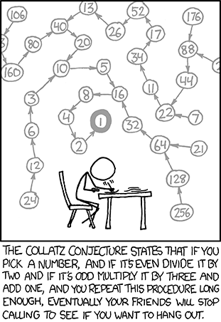
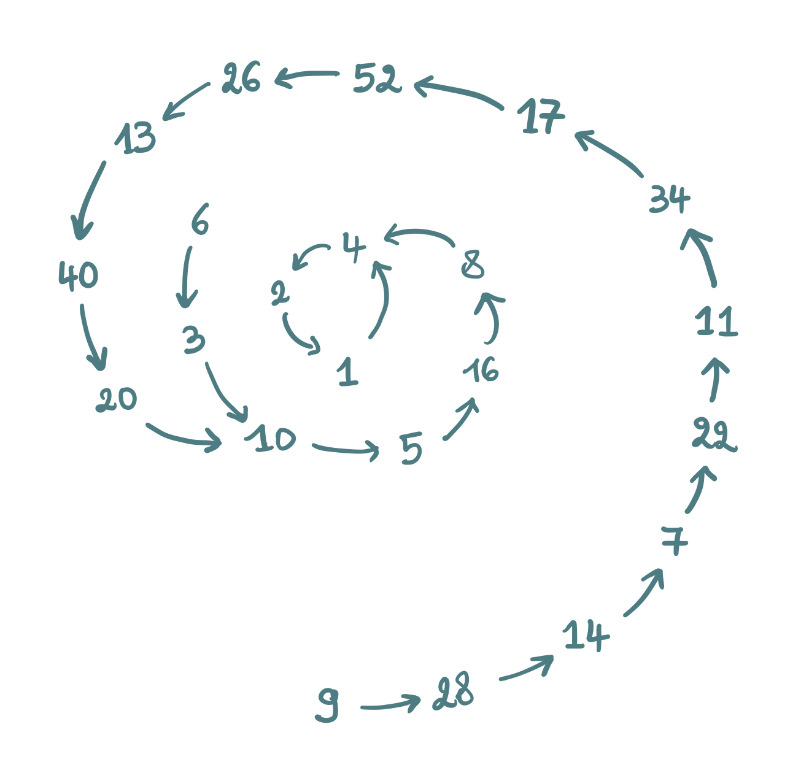
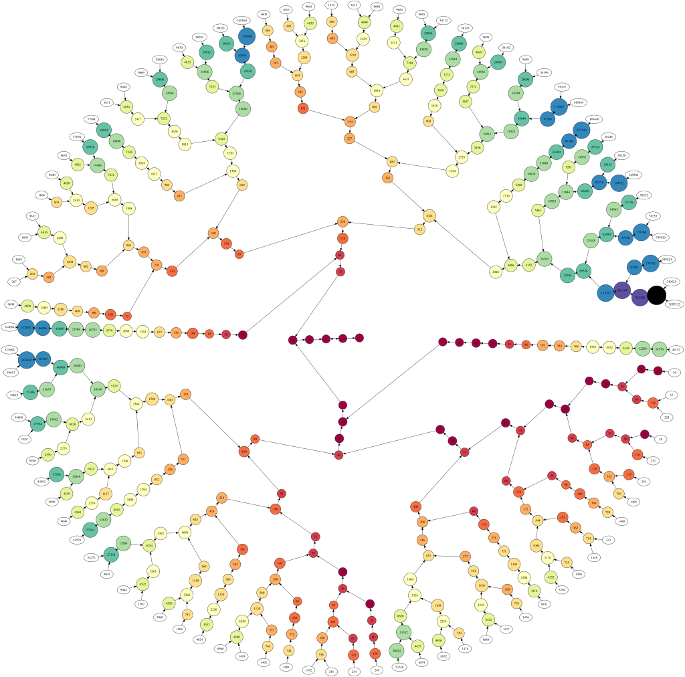

## The Collatz Conjecture

### What is it
The [Collatz Conjecture](https://en.wikipedia.org/wiki/Collatz_conjecture), also known as the "3n + 1 problem" is a mathematical enigma that has remained unsolved for over 80 years, which is named after the mathematician [Lothar Collatz](https://en.wikipedia.org/wiki/Lothar_Collatz), who introduced the idea in 1937. It states that if you take any positive integer and repeatedly apply the following rules, you will eventually reach the number 1.



The rules are as follows:

**If the number is even, divide it by 2.**

**If the number is odd, multiply it by 3 and add 1.**

For example, starting with the number 6 & 9, the sequence would be:



The mystery of the conjecture lies in its deceptive simplicity and the fact that despite extensive computational verification, no general proof exists. The only known cycle is the trivial one (1→4→2→1), and if another cycle were to be discovered, it would disprove the conjecture. Mathematician Paul Erdős famously stated that “Mathematics is not yet ready for such problems,” highlighting the difficulty in proving it.

<br>

Here's a Python code I wrote for fun to demonstrate the conjecture for any given positive integer and a highly obfuscated C code that was generated by Gemini to perform the same calculation.

### python code

```python
def even(num):
    return num//2

def odd(num):
    return 3*num +1

def main():
    print("Collatz conjecture \n")

    num = int(input("Enter a positive integer: \n"))
    i=0
    rec=[num]

    while num!=1:
        
        if num%2 ==0:
            num= even(num)
        else:
            num= odd(num)
            
        rec.append(num)

        i+=1

    print(f"\nIt took {i} steps to reach 1 (one).")
    print("\nSequence: ", rec)

    main()

```

<br>

### obfuscated C code

```c
#include <stdio.h>
#include <stdlib.h>
#include <string.h>

#define _0 printf
#define _1 scanf
#define _2 while
#define _3 int
#define _4 size_t
#define _5 (
#define _6 )
#define _7 return
#define _8 if
#define _9 NULL
#define ___ ((_ & 1) ? (3 * _ + 1) : (_ >> 1))

_3 main_0() {
    _3 _;
    _4 __i = 0;
    _3 *__r = _9;
    _4 _C = 10;

    if _5(_9 == (__r = (_3*)calloc(_C, sizeof(_3)))) _6 { 
        _7 1;
    }

    _0("%s", "Enter a positive integer:\n");
    _1("%d", &_);

    *(__r + __i++) = _;

    _2 1) {
        _8 _5(_ == 1)_6 { break; }
        _8 _5(__i >= _C)_6 {
            _C *= 2;
            if _5(_9 == (__r = (_3*)realloc(__r, _C * sizeof(_3)))) _6 { 
                _7 1;
            }
        }
        *(__r + __i++) = (_ = ___);
    }

    _0("\nIt took %zu steps to reach 1 (one).\n", __i - 1);
    _0("%s\n", "Sequence:");

    _4 __j = 0;
    _2 _5(__j < __i)_6 {
        _0("%d%s", *(__r + __j), (__j == __i - 1) ? "" : ", ");
        __j++;
    }
    _0("\n");
    free(__r);
    _7 0;
}

_3 main() {
    return main_0();
}
```

The tree of all the numbers having fewer than 20 steps. [[View full sized image](https://en.wikipedia.org/wiki/Collatz_conjecture#/media/File:All_Collatz_sequences_of_a_length_inferior_to_20.svg)]



---

#### Published on 09/23/25